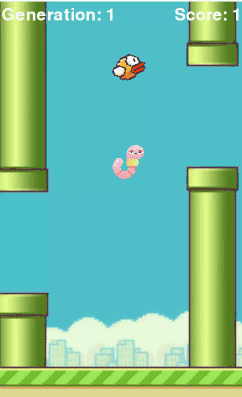

# Using AI to be a Flappy Bird CHAMPION

## Preface
This mini-project serves as a fun introduction to artificial intelligence (AI) for me, and mainly uses Python and its NEAT module. Using AI to evolve fLoPpY bUrT to **FLAPPY BIRD**!

## Fitness Function

Birds (and the neurons) gain fitness if they:
- Progress through the game
- "Consumes" a worm
- Pass through a pipe successfully, without collision

Birds (and the neurons) lose fitness if they:
- Collide into a pipe

The collision between birds and pipes are determined using `pygame.mask.from_surface`, which allows the top and bottom points of overlap to be determined, if any. This makes the collision pixel-accurate, compared to generating boxes around the (non-rectangular) bird models.

## Adjustments
As the program exits after a certain bird's fitness hits the `fitness_threshold` specified in NEAT [configuration file](config-feedforward.txt), that value can be modified to either increase or decrease that threshold.

Additionally, given the relative simplicity of Flappy Bird, a large population size as well as high fitness gains from progressing forward can cause the AI to be *too efficient*, and possibly never collide into pipes by the 1st or 2nd generation. In that case, the population size (`pop_size`) or the fitness gains can be modified.

## Credits
Adapted from a <a href="https://www.youtube.com/channel/UC4JX40jDee_tINbkjycV4Sg">tutorial</a> from <a href="https://www.youtube.com/channel/UC4JX40jDee_tINbkjycV4Sg">Tech With Tim</a>.

Worm icon made by <a href="https://www.flaticon.com/authors/freepik" title="Freepik">Freepik</a> from <a href="https://www.flaticon.com/" title="Flaticon">www.flaticon.com</a>.

